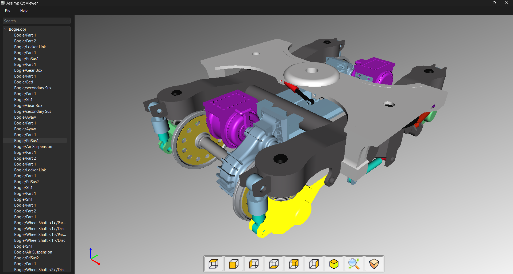

# ModelViewer

An OpenGL-based 3D Model Viewer with CAD-style controls and intuitive user interaction, built using **Qt** and **Assimp**.



---

## ✨ Features

- ✅ Load and view 3D models (via [Assimp](https://github.com/assimp/assimp))
- 🎥 Orbit-style camera controls with inertia
- 🧭 CAD-style projection views (top, front, side, isometric)
- 🔭 Orthographic and perspective projections with smooth toggling
- 📐 Fit-to-view functionality for any model size
- 🧊 Trihedron (XYZ axis marker) with custom OpenGL drawing
- 🖱️ Mouse interaction with zoom, pan, and rotation
- 🖼️ Viewport UI using Qt (custom toolbars and layouts)

---

## 🖱️ Controls

| Input                         | Action                      |
|------------------------------|-----------------------------|
| `Ctrl + Left Mouse Drag`     | Orbit (rotate)              |
| `Ctrl + Right Mouse Drag`    | Pan                         |
| `Ctrl + Middle Mouse Drag`   | Zoom                        |
| `Mouse Wheel`                | Zoom in/out                 |
| `Toolbar Buttons`            | Switch views (top, side...) |
| `Auto Zoom`                  | Fit model to viewport       |

---

## 🧰 Dependencies

- [Qt 5 or 6](https://www.qt.io/)
- [OpenGL](https://www.khronos.org/opengl/)
- [Assimp](https://github.com/assimp/assimp)

---

## 🔧 Build Instructions

```bash
git clone https://github.com/your-username/modelviewer.git
cd modelviewer
mkdir build && cd build
cmake ..
make
./ModelViewer
```

> 💡 Make sure Qt and Assimp are properly installed and discoverable by `cmake`.

---

## 📁 Project Structure

```
ModelViewer/
├── src/
│   ├── main.cpp
│   ├── MainWindow.cpp/.h
│   ├── ModelViewerWidget.cpp/.h
│   ├── GLCamera.cpp/.h
│   ├── Trihedron.cpp/.h
├── shaders/
├── resources/
│   └── icons/
├── CMakeLists.txt
└── README.md
```

---

## 🧪 Tested Platforms

- Windows 10/11 (MSVC, Qt 6.5)
- Linux (GCC, Qt 5.15+)
- macOS (Intel, Qt 6.2)

---

## 📌 TODO

- [ ] Drag-and-drop file loading
- [ ] STL/PLY color and material support
- [ ] Annotation and markup
- [ ] Selection highlighting

---

## 📜 License

This project is open source under the MIT License.

---

## 🙋‍♂️ Acknowledgments

- [Assimp](https://github.com/assimp/assimp) for model import
- [Qt](https://www.qt.io/) for GUI and OpenGL integration